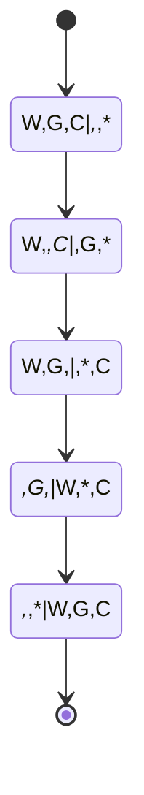

# toy_puzzle_with_datalog
attempt to solve https://en.wikipedia.org/wiki/Wolf,_goat_and_cabbage_problem with clojure (datalog)


## Problem analysis

Let's borrow the concept of state machines and transition between states. We can represent "state" (= location of items) like this :
W G C | * * *  in this case meaning all 3 items are on the left bank ( the right bank has empty slots). For example * G C | W * * means goat and cabbage are on the left bank - the wolf on the right.
Now our job consists of finding a chain of valid transitions (from state X to state Y) such that 
1) every transition makes sense (is possible )
2) they eventually lead to final state * * * | W G C

### Example:

Following transition is impossible/invalid because we can't leave the Goat and the Wolf unattended on the same river bank while we are moving the cabbage across the river.

```mermaid
stateDiagram-v2
[*] --> {M,W,G,C}:{}
{M,W,G,C}:{} --> {W,G}:|{M,C} 

```


### We want our program to give us complete chain like this:





## Solution 

To model our domain with datomic db we need to find a way to represent all (120 = 6 * 5 * 4) states as a set of datoms (https://docs.datomic.com/cloud/whatis/data-model.html#datoms)

One option could be:

| Entity | Attribute | Value | 
| ---- | ------- | ------------ |
| 42 | :state/left-bank | :wolf| 
| 42 | :state/left-bank | :cabbage|
| 42 | :state/right-bank | :goat|

in this example state 42 is represented by 3 rows and would be equivalent to { id: 42 value: " W * C | * G * "}
